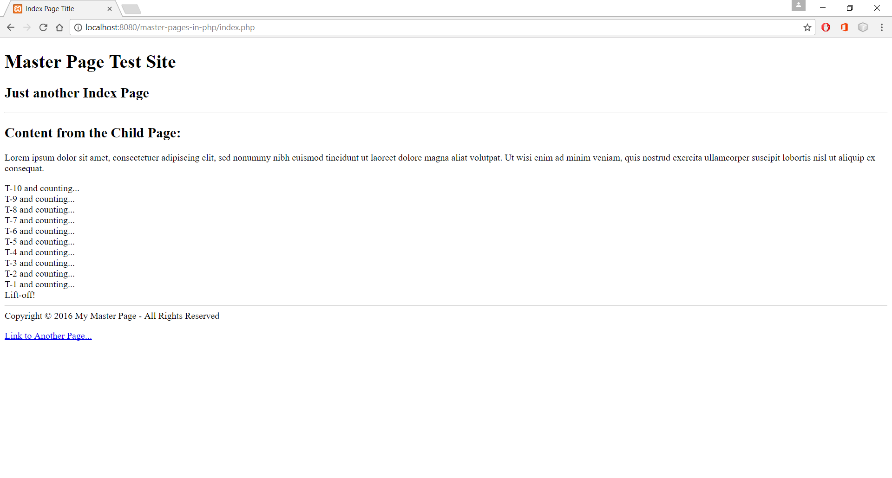
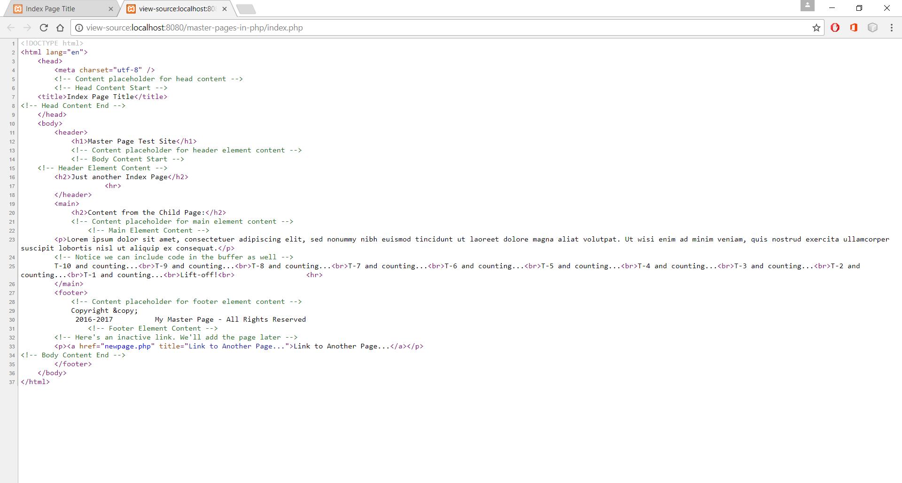
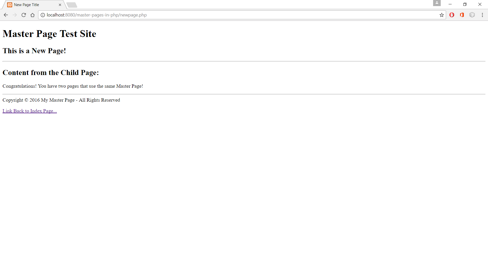

# Master Pages in PHP

## Replicating ASP.NET's Master Pages in PHP

### Introduction

One of the things I like about ASP.NET are [ASP.NET Master Pages](https://msdn.microsoft.com/en-us/library/wtxbf3hh.aspx). If you aren't familiar with the concept, it's simple; think of Master Pages as templates. Instead of having to include duplicate code in each page you write, such as meta tags, footers, etc., you can create a single Master Page that holds all that information. When you write your page, you only code the "meat" of your page, such as the privacy policy text or article. You then call on the Master Page, which takes the "meat" and places it in an appropriate content placeholder in the Master Page, but displays it as the calling page, i.e., default.aspx. The advantages are obvious:

- All pages have a consistent layout</li>
- Changes to the Master Page apply to all pages that call it; no need to edit a dozen pages</li>
- Page code is much smaller and focused</li>
- Master Pages can be dynamic, e.g., you can change the page title in the code-behind, etc.</li>

Unfortunately, PHP does not have a Master Page class. But don't fret; creating Master Pages in PHP is not difficult. The secret lies in working with PHP's [Output Buffering Controls](http://php.net/manual/en/book.outcontrol.php). By using these controls, you can output what you wish to render to a buffer, assign it to a variable, and call it from an included or required page. Let's get started.

---

### Step 1 - Create a Master Page

Add a folder named "MasterPagesInPHP" in your xampp\htdocs directory and then create a file called "master.php". Input the following code into that file:

    <!DOCTYPE html>
    <html lang="en">
        <head>
            <meta charset="utf-8" />
            <!-- Content placeholder for head content -->
            <?php echo $contentPlaceHolder1; ?>
        </head>
        <body>
            <header>
                <h1>Master Page Test Site</h1>
                <!-- Content placeholder for header element content -->
                <?php echo $contentPlaceHolder2; ?>
                

            </header>
            <main>
                <h2>Content from the Child Page:</h2>
                <!-- Content placeholder for main element content -->
                <?php echo $contentPlaceHolder3; ?>
                

            </main>
            <footer>
                <!-- Content placeholder for footer element content -->
                Copyright ©
                <?php printf(" %s ", (date("Y") == 2016 ? "2016" : "2016-" . date("Y"))); ?>
                My Master Page - All Rights Reserved
                <?php echo $contentPlaceHolder4; ?>
            </footer>
        </body>
    </html>

---

### Step 2 - Create a Child Page

Now create a file called "index.php" and input the following code into that file:

    <?php
        /* Start placing content into an output buffer */
        ob_start();
    ?>
    <!-- Head Content Start -->
        <title>Index Page Title</title>
    <!-- Head Content End -->
    <?php
        /* Store the content of the buffer for later use */ 
        $contentPlaceHolder1 = ob_get_contents();
        /* Clean out the buffer, but do not destroy the output buffer */
        ob_clean();
    ?>
    <!-- Body Content Start -->
        <!-- Header Element Content -->
            <h3>Just another Index Page</h3>
            <?php
                /* Store the content of the buffer for later use */ 
                $contentPlaceHolder2 = ob_get_contents();
                /* Clean out the buffer, but do not destroy the output buffer */
                ob_clean();
            ?>
        <!-- Main Element Content -->
            
Lorem ipsum dolor sit amet, consectetuer adipiscing elit, sed nonummy nibh euismod tincidunt ut laoreet dolore magna aliat volutpat. Ut wisi enim ad minim veniam, quis nostrud exercita ullamcorper suscipit lobortis nisl ut aliquip ex consequat.

            <!-- Notice we can include code in the buffer as well -->
            <?php
            for ($x = 10; $x >= 1; $x--) {
                echo "T-$x and counting... ";
            }
            echo "Lift-off! "
            ?>
            <?php
                /* Store the content of the buffer for later use */ 
                $contentPlaceHolder3 = ob_get_contents();
                /* Clean out the buffer once again, but do not destroy the output buffer */
                ob_clean();
            ?>
        <!-- Footer Element Content -->
            <!-- Here's an inactive link. We'll add the page later -->
            
<a href="newpage.php" title="Link to Another Page...">Link to Another Page...</a>

    <!-- Body Content End -->
    <?php
        /* Store the content of the buffer for later use */
        $contentPlaceHolder4 = ob_get_contents();
        /* Clean out the buffer and turn off output buffering */
        ob_end_clean();
        /* Call the master page. It will echo the content of the placeholders in the designated locations */
        include("master.php");
    ?>

Did you notice we can store meta data, HTML code and PHP functions in the output buffer? Now, start Apache and visit your site in a browser (e.g., [http://localhost:8080/MasterPagesInPHP/index.php](http://localhost:8080/MasterPagesInPHP/index.php)):

Tada! Nothing fancy, but everything is in the right spot. By the way, do not click on "Link to Another Page"; you'll just end up with a 404 error right now. While you are here, look at HTML source code of the page; it appears seamless:

---

### Step 3 - Create Another Child Page

Now, let's add the new page. Call it "newpage.php" and add the following code:

    <?php
        /* Start placing content into an output buffer */
        ob_start();
    ?>
    <!-- Head Content Start -->
        <title>New Page Title</title>
    <!-- Head Content End -->
    <?php
        /* Store the content of the buffer for later use */ 
        $contentPlaceHolder1 = ob_get_contents();
        /* Clean out the buffer, but do not destroy the output buffer */
        ob_clean();
    ?>
    <!-- Body Content Start -->
        <!-- Header Element Content -->
            <h2>This is a New Page!</h2>
            <?php
                /* Store the content of the buffer for later use */ 
                $contentPlaceHolder2 = ob_get_contents();
                /* Clean out the buffer, but do not destroy the output buffer */
                ob_clean();
            ?>
        <!-- Main Element Content -->
            
Congratulations! You have two pages that use the same Master Page!

            <?php
                /* Store the content of the buffer for later use */ 
                $contentPlaceHolder3 = ob_get_contents();
                /* Clean out the buffer once again, but do not destroy the output buffer */
                ob_clean();
            ?>
        <!-- Footer Element Content -->
            
<a href="index.php" title="Link Back to Index Page...">Link Back to Index Page...</a>

    <!-- Body Content End -->
    <?php
        /* Store the content of the buffer for later use */
        $contentPlaceHolder4 = ob_get_contents();
        /* Clean out the buffer and turn off output buffering */
        ob_end_clean();
        /* Call the master page. It will echo the content of the placeholders in the designated locations */
        include("master.php");
    ?>

Run the site again and click on "Link to Another Page":

---

### Conclusion

There you go. Using a Master Page allows you to make changes that affect all pages, without having to update each page separately. This makes a site more secure since you reduce the chances of "orphan" pages with outdated code. Right now, our Master Page is pretty bare bones, but you can add styling and more. So go ahead, gussy up your site, and have fun!
